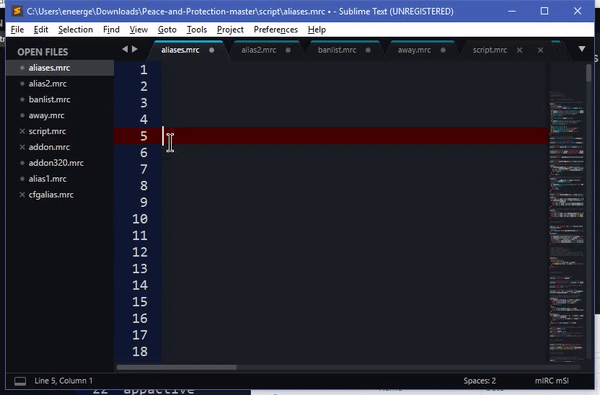
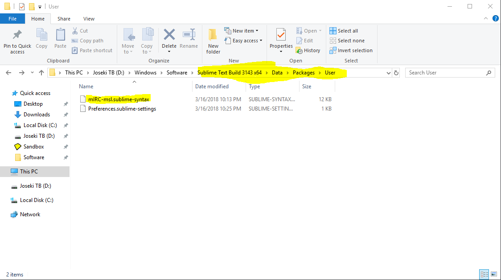
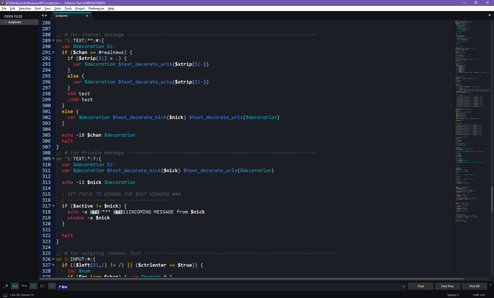

# mIRC-Scripting-Language-for-Sublime-Text
Updated for mIRC 7.52 (March 2018)

- NEW: Autocompletions - Currently auto completes /commands.  I am working on $identifiers

This is my attempt at creating a Sublime Text 3 syntax highlighter for mIRC scripting language.  All $vars and /commands listed in the mIRC help file index should be parsed.  Some undocumented $vars and /commands may be parsed, but I'm sure there's a few that I missed.  Create an issue if any keywords/commands are missing.

Highlighting
---------------
Highlighting currently supports all commands and identifiers in mIRC.  In addition "on/ctcp/raw events" will also highlight.  I try to cover all cases including: commands on new line, commands inline, commands after a |, commands after a {, etc.  I welcome any suggestions for improvement.

Auto Completion
---------------
Autocomplete will work for /commands and $identifiers.  All commands are available.  Identifiers will be added shortly.

Auto Completion - Syntax Assistance
-----------------------------------
In addition to autocompleting commands and identifiers, there will also be a "syntax-" option that can aid you in the development process by doing one or both of the following:
1. HelpAssist - Print the syntax/help of the command or identifier
2. Building - Enable Tabbing through fields of the command/identifier enabling you to "build" the command

Syntax "HelpAssist" is currently limited to "abook through bcopy" (alphabetical) commands.  I am working on adding more.
Command "Building" is currently limited to "aline".

Building will print out the syntax, and highlight the first parameter.  You can then use "tab" to set each parameter. The final tab stop will highlight the syntax helper so you can delete it afterwards.

Bugs
---------------
Let me know if you find any bugs by submitting an Issue.

Installation
------------

1. Copy mIRC-msl.sublime-syntax to Sublime\Data\Packages\User folder.
2. Copy mIRC-msl.sublime-completions to Sublime\Data\Packages\User folder.

You may need to create the Packages\User folder.

A slightly modified theme has been provided in the Extras folder that supports all features of the highlighter. Themes should support the following scopes to support all styles of this highlighter:
1. comment.line.double-slash
2. constant.numeric
3. constant.numeric.line-number.find-in-files
4.entity.name.class
5. entity.name.function
6. entity.name.tag
7. Keyword.control
8. keyword.operator
9. punctuation.definition.comment
10. string
11. variable.parameter

